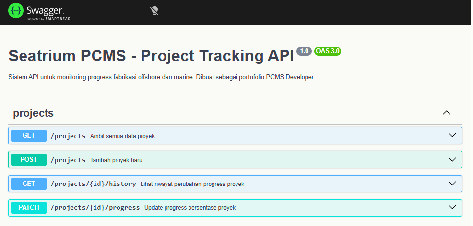

# PCMS - Industrial Project Control Management System (Backend)

Sistem backend terintegrasi yang dirancang khusus untuk memantau progres fabrikasi proyek industri offshore dan marine secara real-time. Proyek ini dikembangkan menggunakan arsitektur modular NestJS dengan fokus pada transparansi data dan integritas laporan melalui fitur Audit Trail.

## 📸 API Documentation Screenshot

*Tampilan dokumentasi API interaktif menggunakan Swagger UI pada port 3003.*

## 🚀 Fitur Unggulan
- **Project Management**: Manajemen data proyek fabrikasi skala besar seperti Jacket, FPSO, dan Substation.
- **Audit Trail (History Log)**: Fitur keamanan otomatis yang mencatat setiap perubahan persentase progres untuk transparansi audit klien.
- **Industrial Data Validation**: Validasi input menggunakan `class-validator` untuk memastikan akurasi data teknis lapangan.
- **Interactive API Documentation**: Dokumentasi OpenAPI/Swagger yang memungkinkan pengujian endpoint secara langsung.

## 🛠 Tech Stack
- **Framework**: NestJS (Node.js)
- **Language**: TypeScript
- **Database**: PostgreSQL
- **ORM**: TypeORM
- **Documentation**: Swagger / OpenAPI

## 🗄️ Konfigurasi Database
Aplikasi ini menggunakan PostgreSQL sebagai media penyimpanan data utama.

1. Buat database di PostgreSQL Anda dengan nama: `db_pcms`
2. Buat file `.env` di direktori utama dan isi dengan konfigurasi berikut:

```env
DB_HOST=localhost
DB_PORT=5432
DB_USERNAME=postgres
DB_PASSWORD=ISI_PASSWORD_DATABASE_ANDA
DB_NAME=db_pcms
```


## 📂 Struktur Folder Utama

* **src/**: Inti logika aplikasi (Modules, Controllers, Services).
* **src/project-entity.ts**: Skema database utama untuk aset proyek.
* **src/project-log.entity.ts**: Skema database untuk sistem pelacakan riwayat (Audit Trail).

## ⚙️ Cara Menjalankan Proyek

1.Clone & Install:
```env
git clone <repository-url>
cd Projects-pcms
npm install
```


2.Running Application:
# development mode
```env
npm run start:dev
```

3.API Access:
Buka browser dan akses http://localhost:3003/api-docs.

## 📊 Contoh Data Simulasi Industri
Sistem ini telah diuji dengan berbagai skenario proyek nyata untuk industri migas dan marine:

* Jacket Fabrication - Struktur pondasi platform lepas pantai.

* FPSO Hull Integration - Integrasi kapal produksi minyak lepas pantai.

* Subsea Piping Installation - Instalasi pipa bawah laut.

* Tanker Hull Refurbishment - Perbaikan dan pemeliharaan kapal tanker.

Developed by Roy Siregar - Computer Science Graduate | Full Stack
